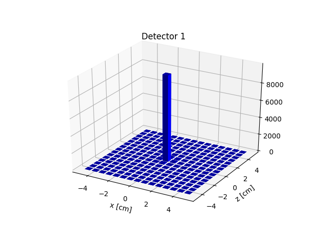
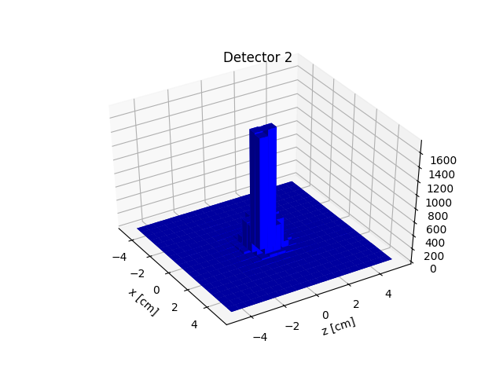

## The following results are for an electron beam fired perpandicular to the detector

Simulation using the Qt interface

Perspective shot of simulation

Side shot of simulation

## Detector Hit Results:

## At 0.5 MeV

## At 1 MeV

## At 10 MeV

