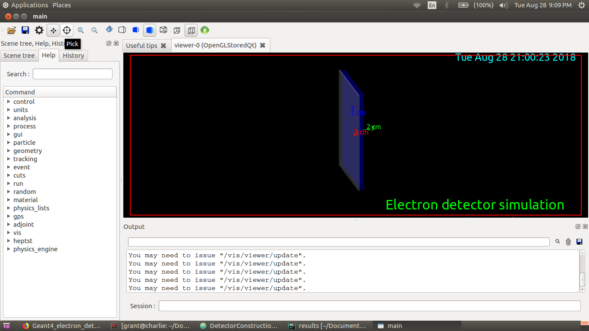
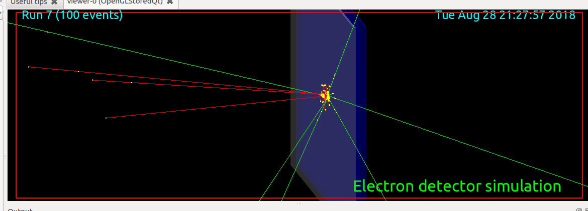
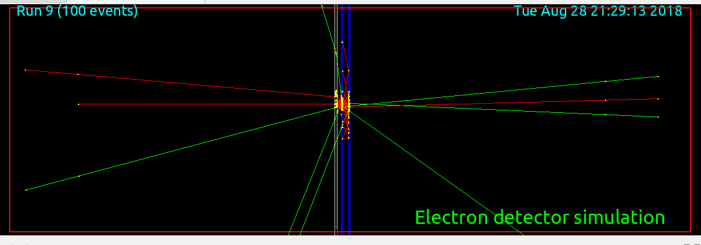
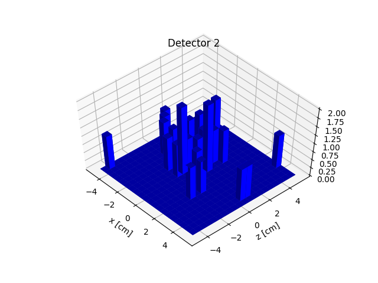
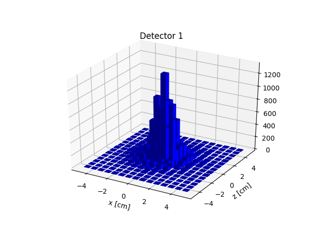
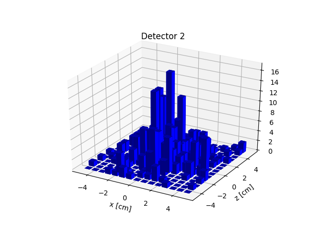
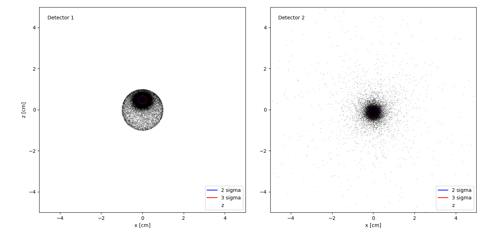

## The following results are for an electron beam fired perpandicular to the detector

Simulation using the Qt interface

Perspective shot of simulation

Side shot of simulation

## Detector Hit Results:

## At 0.5 MeV

## At 1 MeV

## At 30 degrees with respect to detector normal, 1 MeV

# 1 MeV, front window: 50 micron, detector 1: 200 micron, detector 2: 1 mm

