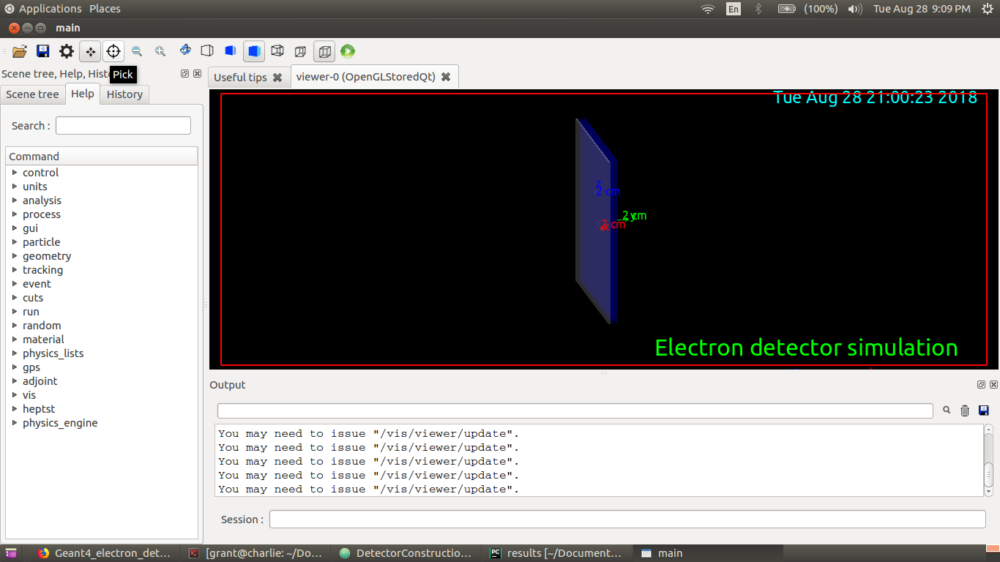
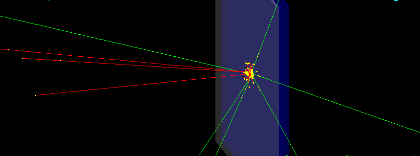
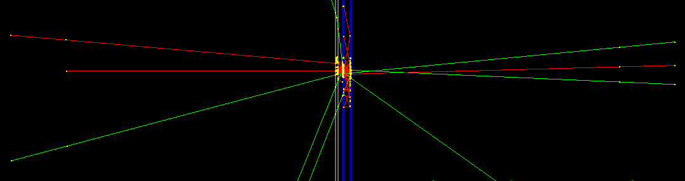
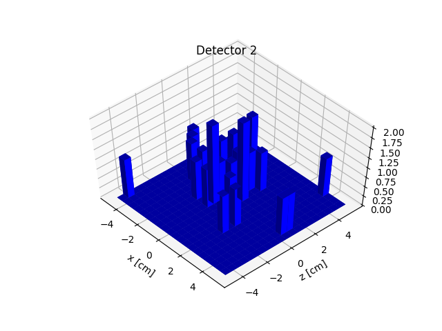
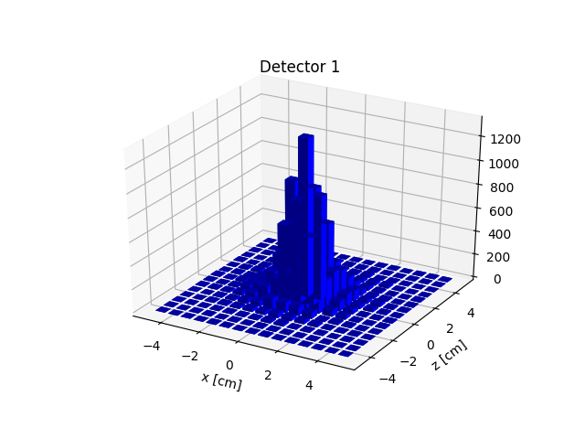
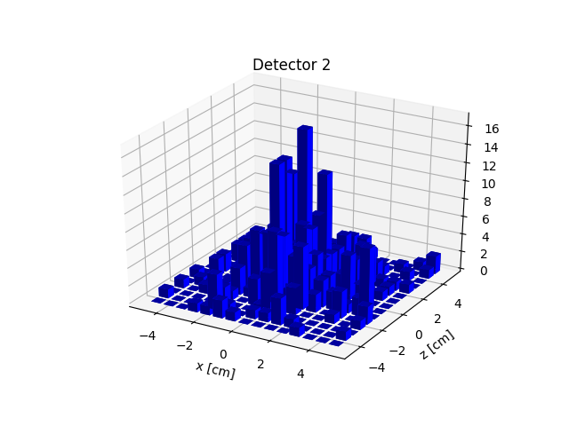
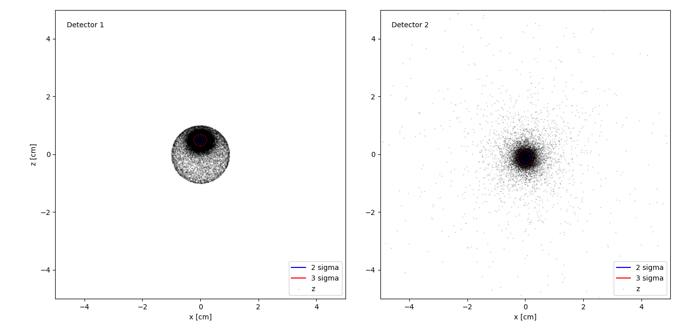
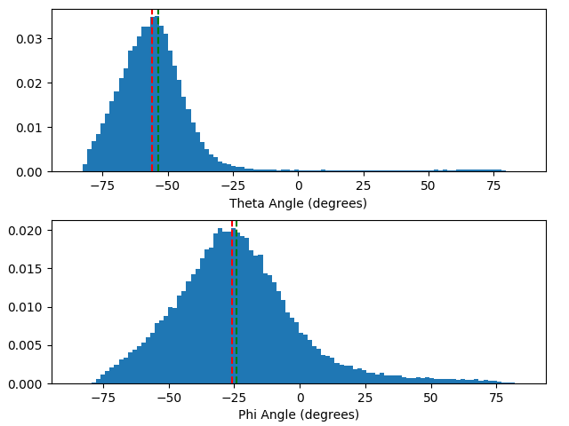

## The following results are for an electron beam fired perpandicular to the detector

Simulation using the Qt interface

Perspective shot of simulation

Side shot of simulation

## Detector Hit Results:

## At 0.5 MeV

## At 1 MeV

## At 30 degrees with respect to detector normal, 1 MeV

## 1 MeV, front window: 50 micron, detector 1: 200 micron, detector 2: 1 mm

Output for 500 keV, theta = 30 deg

Skew of hits:
0.0007204448573444654 -1.39016218361432
-0.7555743029859372 0.191830417795372
-------------------------------------------------------------
Number of particles: 110000
Actual [degrees]: theta=30.0, phi=0.0
Experimental [degrees]: theta=24.3513, phi=90.2832
(Theta, Phi) absolute error [degrees]: (-5.6487, 90.2832)
-------------------------------------------------------------

Theta = 60 deg, Phi = 30 deg, E = 8 MeV

